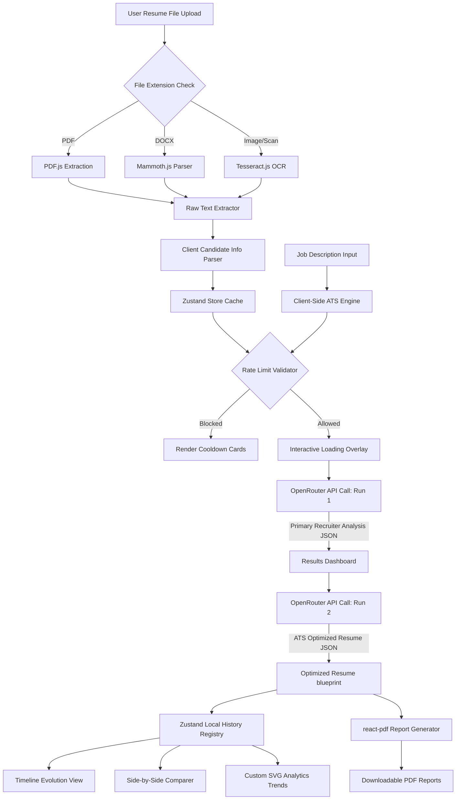
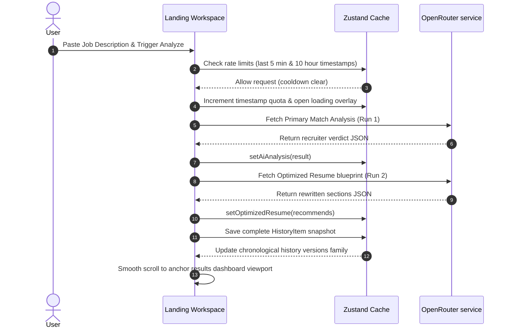

# ResumeIQ

> Optimize. Match. Get Hired.

ResumeIQ is a launch-ready commercial SaaS application engineered to analyze candidate resumes against target job descriptions. The platform computes immediate client-side ATS compliance audits, calls OpenRouter reasoning models to generate detailed recruiter-style alignment reports, constructs optimized resume blueprints, lists previous runs as chronological version folders, visualizes progress through custom animated SVG charts, and compiles PDF reports in-browser.

---

## Technical Architecture Overview

The system is constructed entirely on the client, utilizing persistent state adapters to ensure local data security.



### Core Architecture Components

1. **Local State Store ([useResumeStore.ts](file:///d:/ResumeIQ/src/store/useResumeStore.ts))**:
   Zustand handles theme switches, active file extractions, job parameters, candidate profile previews, rates quotas, and historical timelines, persisting the state inside the browser's local storage.
2. **Client-Side ATS Matching Engine ([atsEngine.ts](file:///d:/ResumeIQ/src/utils/atsEngine.ts))**:
   Uses tokenizers and tf-idf calculations to compare the resume text with job details instantly, scoring keyword density (45%), skill overlap ratios (40%), and layout styling rules (15%).
3. **Defensive API Connector ([openrouter.ts](file:///d:/ResumeIQ/src/services/openrouter.ts))**:
   Integrates double-run fetch loops targeting `nvidia/nemotron-3-nano-omni-30b-a3b-reasoning:free`. Features timeout signals, error retry loops, Zod validator schemas, and JSON syntax repair systems to recover from format glitches.
4. **Browser PDF Compilation**:
   Generates single-page ATS-formatted profiles and multi-page recruiter diagnostics in-browser using `@react-pdf/renderer` download streams.

---

## Detailed Data Synchronization Pipeline



---

## Key Capabilities

- **Quota Enforcement**: Persistent rate limiting checks requests locally to prevent API key exhaustions (capped at 5/minute and 10/hour).
- **Evolution Timelines**: History files sharing matching parent tokens are grouped into an interactive chronological line chart, enabling users to jump between revisions of their resume.
- **Diagnostics Diffs**: Compare any two reports side-by-side to highlight score deltas, resolved deficits, and formatting regressions.
- **Custom Charts**: Responsive horizontal graphs and progress gauges written in custom SVG paths and animated with Framer Motion, avoiding external React 19 package version conflicts.
- **Local Settings Backups**: Export your complete historical database as a `.json` backup file, or upload and merge external archives.

---

## Getting Started

### Prerequisites

- Node.js (version 18 or higher)
- npm package manager

### Environment Configuration

Create a `.env` file in the root of the project:

```env
VITE_OPENROUTER_API_KEY=your_openrouter_api_key_here
```

### Installation

1. Install project dependencies:
   ```bash
   npm install
   ```

2. Start the local Vite development server:
   ```bash
   npm run dev
   ```

3. Build the application for production packaging:
   ```bash
   npm run build
   ```

## Technology Stack

- **Framework**: React 19, Vite, TypeScript
- **Styling**: Tailwind CSS, Framer Motion
- **Parsing**: Mammoth.js (Word files), PDF.js (PDF files), Tesseract.js (OCR scans)
- **Exports**: `@react-pdf/renderer` (In-browser compilation)
- **State**: Zustand (Persist LocalStorage wrapper)
- **Routing**: React Router (`HashRouter` client navigation)
